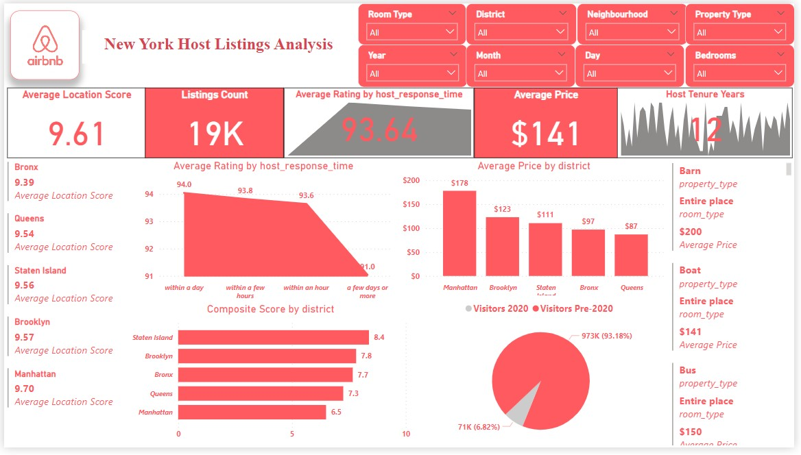
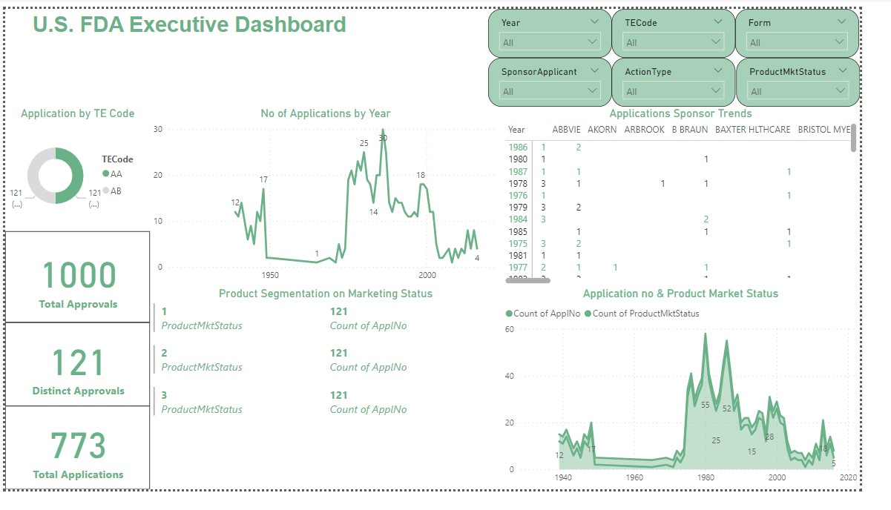
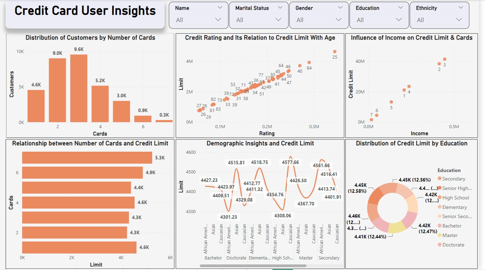
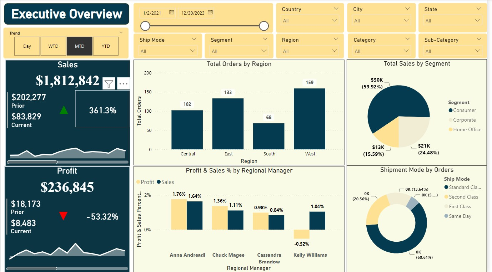

# Power BI Dashboards for Analysis

## Introduction

Welcome to the collection of Power BI Dashboards. This repository showcases work on providing insightful analytics across various datasets, from the dynamics of the AirBnB marketplace to the rigorous approval process of the US FDA. These dashboards are designed to offer both granular details and high-level overviews for informed decision-making.

## Project Descriptions

### AirBnB Dashboard

#### Goals

- **Assessing District Location Scores**: Identify districts with the least favorable location scores to pinpoint areas for improvement or targeted marketing.
- **Examining Host Response Time Impact**: Explore the relationship between host response times and overall listing ratings, offering insights into the importance of communication.
- **Visualizing Airbnb Listing Prices**: Create visual representations of listing prices across different cities, highlighting trends and variations.
- **Analyzing Composite Scores**: Develop a composite score combining check-in experience and host communication, offering insights into service quality across districts.
- **Calculating Listing Age and Host Tenure**: Compute the age of listings and identify hosts with over ten years of hosting, showcasing experience and reliability.
- **Property Type Price Analysis**: Use a visual tree map to display average prices for various room and property types, focusing on the highest prices for entire places.
- **Crafting a Comprehensive City Insights Report**: Generate a report detailing listing prices, guest ratings, and visitor trends across cities, with a focus on 2020's visitor trends compared to previous years.

#### Key Features

- Interactive maps and charts highlighting location scores, price trends, and host response times.
- Composite score analysis for service quality assessment.
- Visual tree maps showing price segmentation by property type.
- Comprehensive reports on city insights with trends over the years.

### US Food & Drug Administration (FDA) Analysis Dashboard

#### Goals

- **Yearly Approval Trends Visualization**: Highlight significant patterns or fluctuations in drug approval trends over the years.
- **Sponsor-based Approval Trends Exploration**: Analyze approval rates among different sponsors over time, uncovering patterns and changes.
- **MarketingStatus Segmentation Visualization**: Show the segmentation of products based on MarketingStatus.
- **Applications Count by MarketingStatus**: Display the total number of applications for each MarketingStatus, with filters for detailed analysis.
- **Dosage Form Analysis**: Visualize the distribution of approvals across different dosage forms and identify the most successful forms.
- **Therapeutic Classes Approvals Visualization**: Identify therapeutic classes with the highest number of approvals, showcasing areas of focus in drug development.

#### Key Features

- Detailed visualizations of yearly drug approval trends.
- Analysis of sponsor-based trends and changes in approval rates.
- Product segmentation based on MarketingStatus.
- Distribution of drug approvals by dosage form and therapeutic classes.

### Credit Card User Analysis Dashboard

#### Goals

- **Spending Pattern Analysis**: Analyze spending patterns across various categories and demographics to understand consumer behavior better.
- **Credit Utilization and Payment Behavior**: Examine how different segments of customers utilize their credit and their payment habits, providing insights into financial health.
- **Fraud Detection**: Implement and highlight fraud detection mechanisms to identify and alert on unusual spending behaviors, protecting both the issuer and the cardholder.

#### Data Sources

- Anonymized transaction data from credit card operations.
- Demographic information of cardholders for segmentation analysis.

#### Key Features

- Detailed breakdown of spending by category and demographics.
- Visualizations on credit utilization trends and payment habits.
- Fraud detection indicators with an alert system for suspicious activities.

### Executive Dashboard on Sales & Orders

#### Goals

- **Sales Performance Overview**: Provide a clear, concise overview of sales performance, including trends, outliers, and key performance indicators (KPIs).
- **Order Fulfillment Efficiency**: Analyze order processing and fulfillment efficiency, highlighting areas for improvement in the supply chain.
- **Revenue Projections**: Offer forward-looking insights with revenue projections based on current sales trends and historical data.

#### Data Sources

- Comprehensive sales data covering various products, regions, and time periods.
- Detailed records of order processing, fulfillment, and delivery.

#### Key Features

- High-level and granular views of sales trends, performance metrics, and KPIs.
- Insights into order fulfillment processes, including efficiency metrics and bottleneck identification.
- Predictive analytics for revenue forecasting, with scenario planning capabilities.

